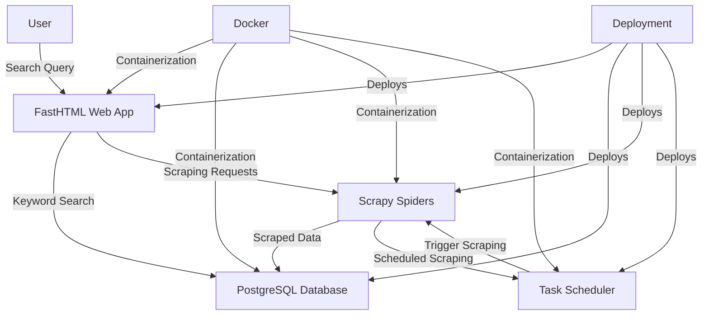

# Meta Search



Meta Search is a web application that scrapes data from specified websites and APIs, processes the data, and provides a search interface for users to query the scraped content. The application is built using Python, Scrapy, FastHTML, and PostgreSQL, and it utilizes Docker for containerization.

## Features

- Scheduled data scraping from multiple sources (websites and APIs).
- Storage of scraped data in a PostgreSQL database.
- Keyword search functionality for querying the scraped content.
- Dynamic and interactive user interface built with FastHTML and HTMX.
- Horizontal scaling with PostgreSQL running as a sidecar container.

## Technologies Used

- **Python**: Programming language for the application.
- **Scrapy**: Framework for web scraping.
- **FastHTML**: HTMX-compatible Python framework for building the web application.
- **PostgreSQL**: Database for storing scraped data.
- **Docker**: Containerization platform for deploying the application.

## Getting Started

### Prerequisites

- Docker
- Docker Compose
- Python 3.x

### Installation

1. Clone the repository:

   ```bash
   git clone https://github.com/yourusername/meta-search.git
   cd meta-search
   ```

2. Build the Docker containers:

   ```bash
   docker-compose build
   ```

3. Start the application:

   ```bash
   docker-compose up
   ```

4. Access the application in your web browser at `http://localhost:8000`.

### Configuration

- Update the scraping settings in the Scrapy spider files located in the `scrapy_spiders` directory.
- Configure the PostgreSQL connection settings in the `docker-compose.yml` file if necessary.

## Usage

- The application will automatically scrape data from the configured sources based on the scheduled process.
- Use the search bar on the homepage to perform keyword searches on the scraped content.

## Testing

- Ensure that all components are working together by running integration tests.
- Use the following command to run tests (if applicable):

   ```bash
   pytest
   ```

## Deployment

- The application can be deployed using Docker Compose, which manages the deployment of both the FastHTML web app and the PostgreSQL sidecar containers.
- Ensure that the deployment process allows for seamless updates and scaling.

## Contributing

Contributions are welcome! Please open an issue or submit a pull request for any enhancements or bug fixes.

## License

This project is licensed under the MIT License - see the [LICENSE](LICENSE) file for details.

## Acknowledgments

- [Scrapy](https://scrapy.org/) - For the web scraping framework.
- [FastHTML](https://fasthtml.org/) - For the web application framework.
- [PostgreSQL](https://www.postgresql.org/) - For the database solution.